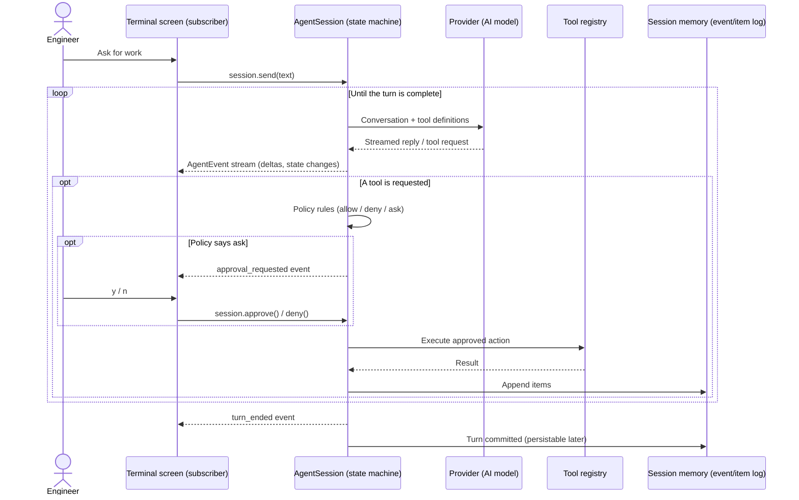
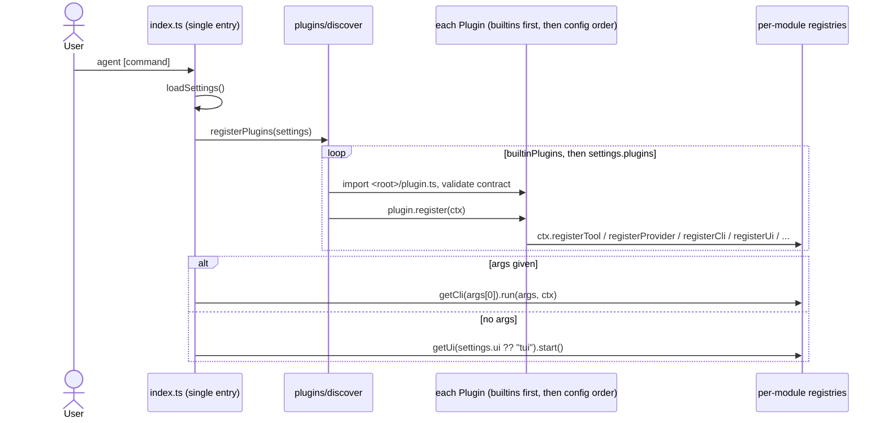

# Agent Harnes

A terminal coding harness: an agentic TUI that integrates with AI providers to do real development work in your project. Built in small working increments — `0.0.x` releases grow feature by feature until `0.1.0`, which is **v0, the beta**.

## Vision

Customizable and extensible full coding harness that remains as small as possible and allows everyone to extend and change its behaviours.

## Architecture

One sentence: **a headless agent core emits a typed, serializable, unidirectional event stream per session; UIs are subscribers; commands flow in through a narrow typed surface; every feature — tools, providers, CLIs, prompt, policy, the TUI itself — is contributed through plugin registration.**

### Plugins

A plugin is a folder with a `plugin.ts` default-exporting the contract in `src/plugins/types.ts`; its `register(ctx)` introduces contributions through the per-module registries. Built-ins (`src/plugins/builtins.ts`) register first, then external plugins from `~/.config/agent/config.json` in order; later plugins can extend or replace anything. A failing plugin is skipped and reported, never fatal.

### Principles

- Customizable and Extensible by supporting plugins
- Plugins must not rely on eachother. This will make a circular dependencies.

## Conventions

- Early returns over nested conditions.
- Typed wire boundaries; narrow `unknown` with `lib/json` guards, never `as` casts.
- Typed event unions at seams; exhaustive switches.
- No code comments.
- No backward compatibility. only clean solutions.
- No tests.
- Write simple and readable code and avoid extra complexity.
- If a constant will be used only one time, Do not overengineer to make it `const`. this reduces the code readability.

## Linting & Formatting

Use `bun checks:fix` to fix any formatting or linting if you modified files that are subject to this.
