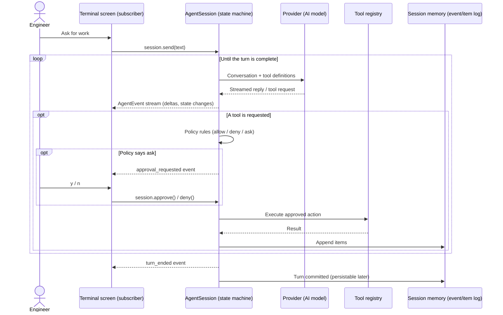
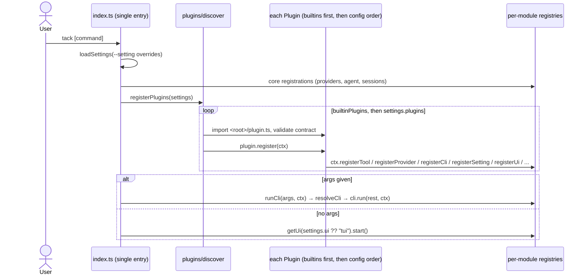

# Tack

A terminal coding harness: an agentic TUI that integrates with AI providers to do real development work in your project. Built in small working increments — `0.0.x` releases grow feature by feature until `0.1.0`, which is **v0, the beta**.

## Vision

Customizable and extensible full coding harness that remains as small as possible and allows everyone to extend and change its behaviours.

## Temp Development Goal

Reach to a point where we can continue the development of this app using itself. this means enough features to develop it by itself.

This is a Temp goal and we consider it when we pick a task or decide which feature to work on.

## Architecture

One sentence: **a headless agent core emits a typed, serializable, unidirectional event stream per session; UIs are subscribers; commands flow in through a narrow typed surface; every feature — tools, providers, CLIs, prompt, policy, the TUI itself — is contributed through plugin registration.**

### Principles

- Customizable and Extensible by supporting plugins
- Plugins must not rely on eachother. This will make a circular dependencies and this is a hard violation.

## Conventions

- Early returns over nested conditions.
- Typed wire boundaries; narrow `unknown` with `lib/json` guards, never `as` casts.
- Typed unions at seams; handle every case so a new one cannot slip through silently.
- No code comments.
- No backward compatibility. only clean solutions.
- No tests.
- Write simple and readable code and avoid extra complexity.
- If a constant will be used only one time, Do not overengineer to make it `const`. this reduces the code readability.
- Do not write what already exists; reuse it or extract it to one shared place.
- Do not patch symptoms. Fix the root cause.
- Fail loudly. Never swallow an error, and never write data after ignoring one.
- Whatever you write, you must read back in the same shape.
- Build on guarantees, not coincidences.
- Everything must have a consumer today; delete what nothing uses.
- Leave every file you touch consistent with the rules and its neighbors.
- Do not update AGENTS.md unless user specificly asks for.
- Do not overtest, only critical paths need testing

## Linting & Formatting

Use `bun checks:fix` to fix any formatting or linting if you modified files that are subject to this.
